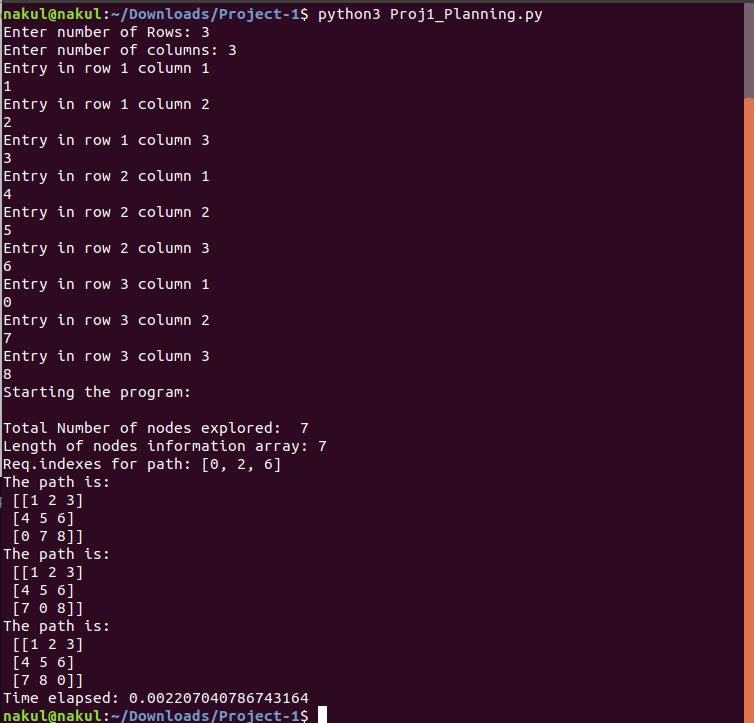

# 8-Puzzle-Solver
Implementation of 8-puzzle-solver using Brute Force Search Algorithm .

## Overview:
This is the first project in the course ENPM661: Planning for Autonomous Robots.

It uses the Brute Force Search Algorithm to find the path to the goal state by exploring all the possible states of 8-puzzle.

## Instructions:

Type following command in the terminal:

`python3 eight_puzzle_bfs.py`

The code prompts to enter the rows and columns, in which you should enter 3 each, since we will need a 3x3 matrix for storing any state of 8-puzzle.

Then enter the elements of puzzle, one by one.For example, on entering 1 2 3, 4 5 6, 0 7 8 (row wise), we will reach to the goal state in 3 steps(nodes). You will see following output in the terminal.

Also, the code gives following output in the text files:

- Nodes_Path.txt - Stores all the nodes for final path from initial to final state. 
- Nodes_information.txt - Stores the node number, parent node number, and the cost-to-come.
- Nodes_explored.txt - Stores all the nodes explored.

For Nodes_explored and Nodes_Path, the sample output is stored as explained in the following example, i.e, for a state 1 2 3, 4 5 6, 0 7 8(row wise), the information in text file is stored as 1 4 0 2 5 3 6 8.
